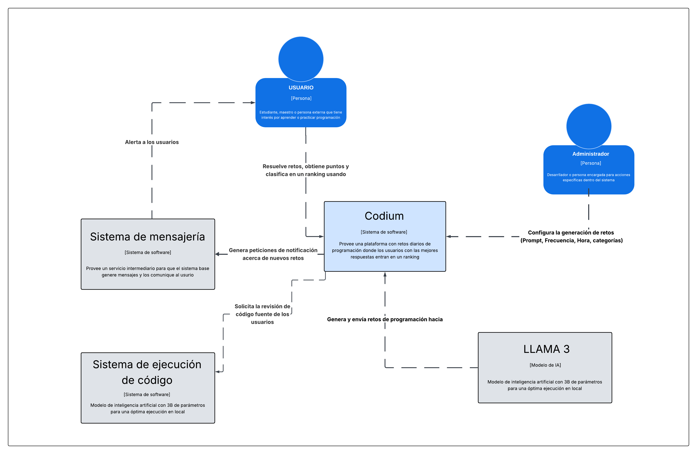
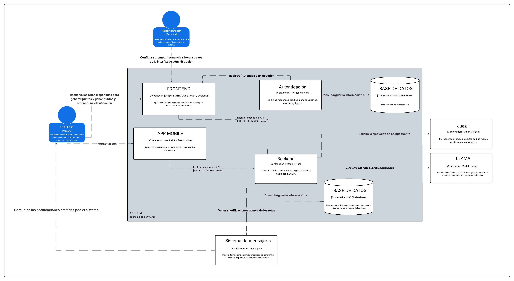
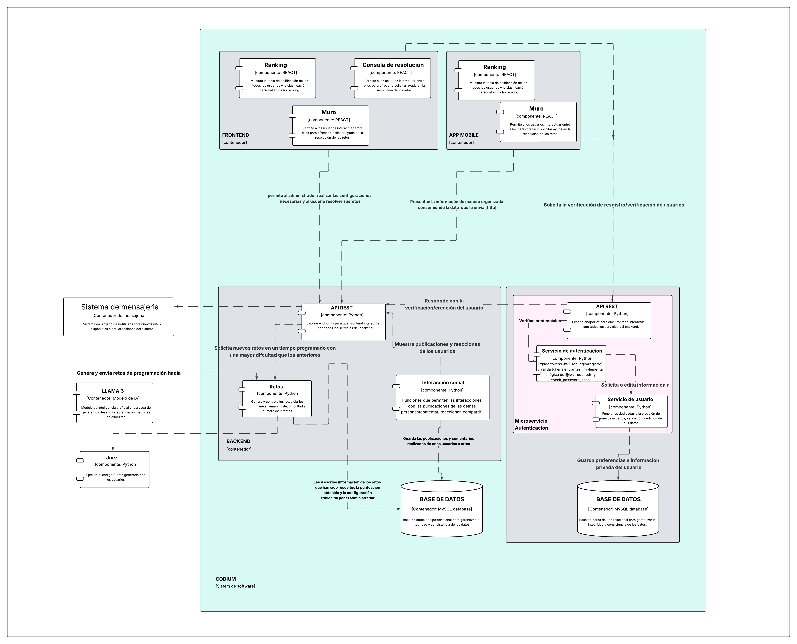
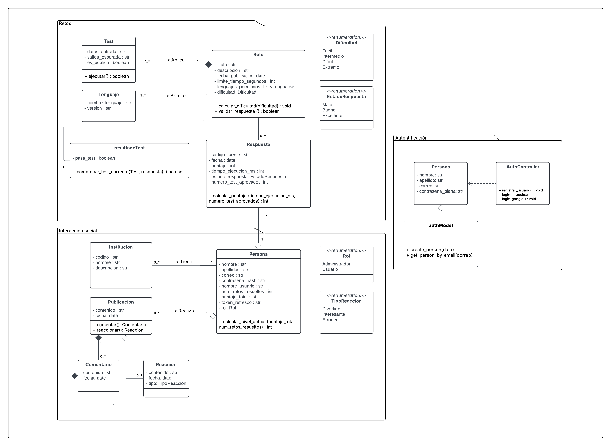

## Diagramas C4

Para visualizar la arquitectura del sistema Codium, utilizamos el modelo C4, detallando los niveles de contexto, contenedores y componentes.

### Nivel 1: Diagrama de Contexto
Muestra cómo interactúa el sistema con los usuarios y sistemas externos.

{#fig-contexto width=95%}

### Nivel 2: Diagrama de Contenedores
Detalla las aplicaciones y bases de datos que componen el sistema (Frontend Web, App Móvil, API Backend, BD).

{#fig-contenedores width=95%}

### Nivel 3: Diagrama de Componentes
Desglosa internamente cómo está estructurada la API Backend y sus módulos principales.

{#fig-componentes width=95%}

## Nivel 4: Diagramas de Código
Para detalles específicos de implementación, consulte los capítulos dedicados a Backend, Frontend y Móvil, donde se describen las estructuras de código y tecnologías utilizadas.

{#fig-clases width=90%}